# Data Lineage Diagrams

Shows exactly which source BNM datasets are combined at each stage to produce each harmonised (`h_`) output.

**Pipeline stages:**
1. **Ingest** — Excel files → raw DuckDB tables
2. **Column map** — raw → `m_` tables (renames only, every table)
3. **Stitch** — `m_` tables → `s_` tables (UNION of current + historical editions, dedup by date)
4. **Domain** — `m_`/`s_` tables → `h_` tables (FULL OUTER JOIN on date + frequency)

**Shape legend:**

| Shape | Meaning |
|-------|---------|
| Rectangle | Source dataset (raw Excel → `m_` table) |
| Hexagon | Stitch table (`s_`) — UNION of multiple editions |
| Stadium | Harmonised output (`h_`) |

---

## 1. Monetary System

Covers: `h_1_money_supply`, `h_2_currency_in_circulation`, `h_3_bnm_balance_sheet`, `h_4_liquidity_reserves`

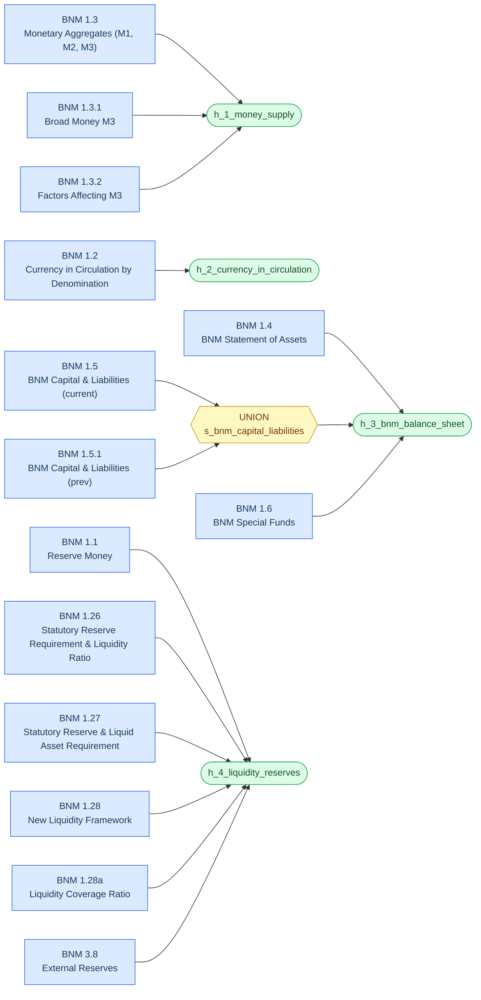
```mermaid
flowchart LR
    classDef raw fill:#dbeafe,stroke:#2563eb,color:#1e3a5f
    classDef stitch fill:#fef9c3,stroke:#ca8a04,color:#78350f
    classDef out fill:#dcfce7,stroke:#16a34a,color:#14532d

    r_1_3["BNM 1.3\nMonetary Aggregates (M1, M2, M3)"]:::raw
    r_1_3_1["BNM 1.3.1\nBroad Money M3"]:::raw
    r_1_3_2["BNM 1.3.2\nFactors Affecting M3"]:::raw
    h1(["h_1_money_supply"]):::out

    r_1_3 --> h1
    r_1_3_1 --> h1
    r_1_3_2 --> h1

    r_1_2["BNM 1.2\nCurrency in Circulation by Denomination"]:::raw
    h2(["h_2_currency_in_circulation"]):::out

    r_1_2 --> h2

    r_1_4["BNM 1.4\nBNM Statement of Assets"]:::raw
    r_1_5["BNM 1.5\nBNM Capital & Liabilities (current)"]:::raw
    r_1_5_1["BNM 1.5.1\nBNM Capital & Liabilities (prev)"]:::raw
    r_1_6["BNM 1.6\nBNM Special Funds"]:::raw
    st_bnm{{"UNION\ns_bnm_capital_liabilities"}}:::stitch
    h3(["h_3_bnm_balance_sheet"]):::out

    r_1_5 --> st_bnm
    r_1_5_1 --> st_bnm
    r_1_4 --> h3
    st_bnm --> h3
    r_1_6 --> h3

    r_1_1["BNM 1.1\nReserve Money"]:::raw
    r_1_26["BNM 1.26\nStatutory Reserve Requirement & Liquidity Ratio"]:::raw
    r_1_27["BNM 1.27\nStatutory Reserve & Liquid Asset Requirement"]:::raw
    r_1_28["BNM 1.28\nNew Liquidity Framework"]:::raw
    r_1_28a["BNM 1.28a\nLiquidity Coverage Ratio"]:::raw
    r_3_8["BNM 3.8\nExternal Reserves"]:::raw
    h4(["h_4_liquidity_reserves"]):::out

    r_1_1 --> h4
    r_1_26 --> h4
    r_1_27 --> h4
    r_1_28 --> h4
    r_1_28a --> h4
    r_3_8 --> h4
```

---

## 2. Banking System — Balance Sheet

Covers: `h_5_banking_balance_sheet`

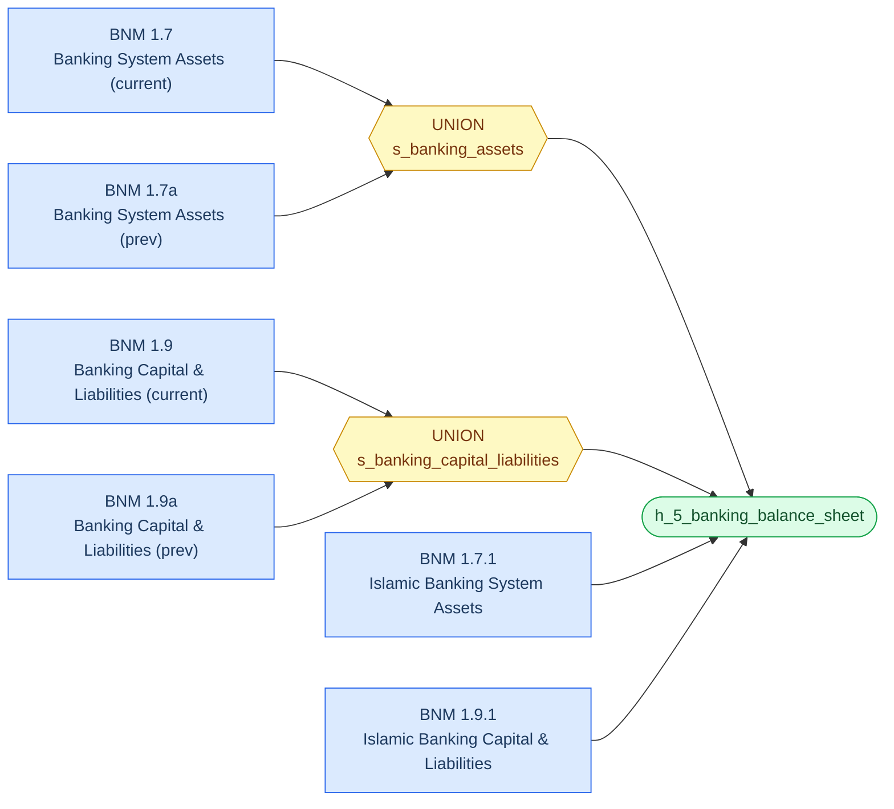
```mermaid
flowchart LR
    classDef raw fill:#dbeafe,stroke:#2563eb,color:#1e3a5f
    classDef stitch fill:#fef9c3,stroke:#ca8a04,color:#78350f
    classDef out fill:#dcfce7,stroke:#16a34a,color:#14532d

    r_1_7["BNM 1.7\nBanking System Assets (current)"]:::raw
    r_1_7a["BNM 1.7a\nBanking System Assets (prev)"]:::raw
    st_ba{{"UNION\ns_banking_assets"}}:::stitch

    r_1_9["BNM 1.9\nBanking Capital & Liabilities (current)"]:::raw
    r_1_9a["BNM 1.9a\nBanking Capital & Liabilities (prev)"]:::raw
    st_bcl{{"UNION\ns_banking_capital_liabilities"}}:::stitch

    r_1_7_1["BNM 1.7.1\nIslamic Banking System Assets"]:::raw
    r_1_9_1["BNM 1.9.1\nIslamic Banking Capital & Liabilities"]:::raw

    h5(["h_5_banking_balance_sheet"]):::out

    r_1_7 --> st_ba
    r_1_7a --> st_ba
    r_1_9 --> st_bcl
    r_1_9a --> st_bcl

    st_ba --> h5
    st_bcl --> h5
    r_1_7_1 --> h5
    r_1_9_1 --> h5
```

---

## 3. Banking System — Loans by Purpose

Covers: `h_6a_loans_by_purpose`

Each of the four loan flows (applied / approved / disbursed / repaid) stitches current + historical editions before joining.

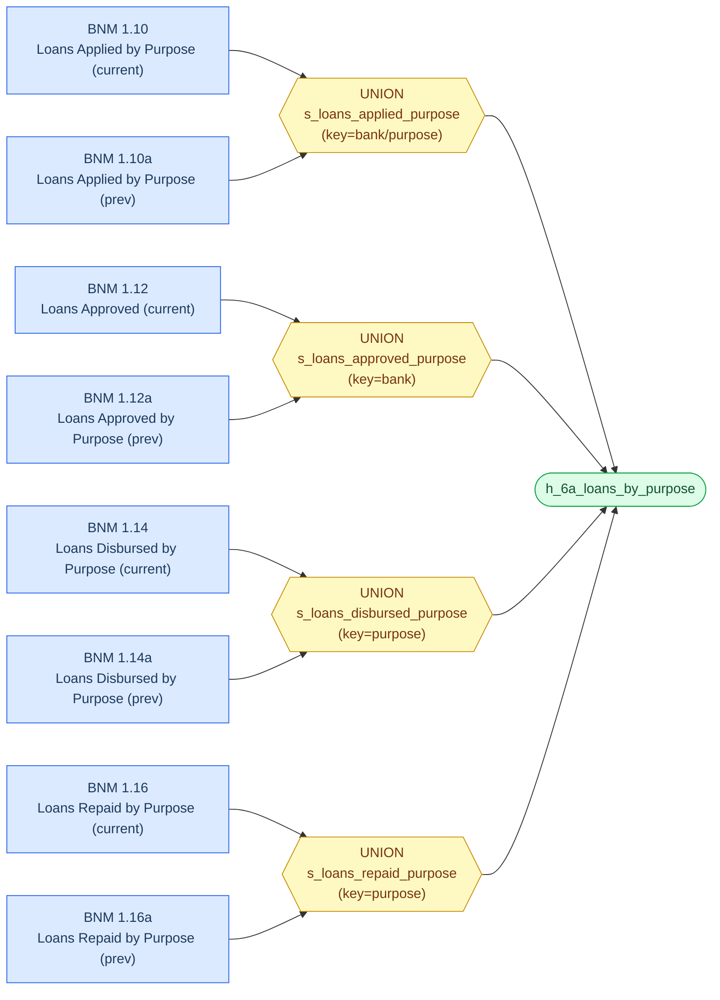
```mermaid
flowchart LR
    classDef raw fill:#dbeafe,stroke:#2563eb,color:#1e3a5f
    classDef stitch fill:#fef9c3,stroke:#ca8a04,color:#78350f
    classDef out fill:#dcfce7,stroke:#16a34a,color:#14532d

    r_1_10["BNM 1.10\nLoans Applied by Purpose (current)"]:::raw
    r_1_10a["BNM 1.10a\nLoans Applied by Purpose (prev)"]:::raw
    st_lap{{"UNION\ns_loans_applied_purpose\n(key=bank/purpose)"}}:::stitch

    r_1_12["BNM 1.12\nLoans Approved (current)"]:::raw
    r_1_12a["BNM 1.12a\nLoans Approved by Purpose (prev)"]:::raw
    st_lvp{{"UNION\ns_loans_approved_purpose\n(key=bank)"}}:::stitch

    r_1_14["BNM 1.14\nLoans Disbursed by Purpose (current)"]:::raw
    r_1_14a["BNM 1.14a\nLoans Disbursed by Purpose (prev)"]:::raw
    st_ldp{{"UNION\ns_loans_disbursed_purpose\n(key=purpose)"}}:::stitch

    r_1_16["BNM 1.16\nLoans Repaid by Purpose (current)"]:::raw
    r_1_16a["BNM 1.16a\nLoans Repaid by Purpose (prev)"]:::raw
    st_lrp{{"UNION\ns_loans_repaid_purpose\n(key=purpose)"}}:::stitch

    h6a(["h_6a_loans_by_purpose"]):::out

    r_1_10 --> st_lap
    r_1_10a --> st_lap
    r_1_12 --> st_lvp
    r_1_12a --> st_lvp
    r_1_14 --> st_ldp
    r_1_14a --> st_ldp
    r_1_16 --> st_lrp
    r_1_16a --> st_lrp

    st_lap --> h6a
    st_lvp --> h6a
    st_ldp --> h6a
    st_lrp --> h6a
```

---

## 4. Banking System — Loans by Sector

Covers: `h_6b_loans_by_sector`

Approved, disbursed, and repaid by sector each stitch **three** editions (current + prev + prev2).

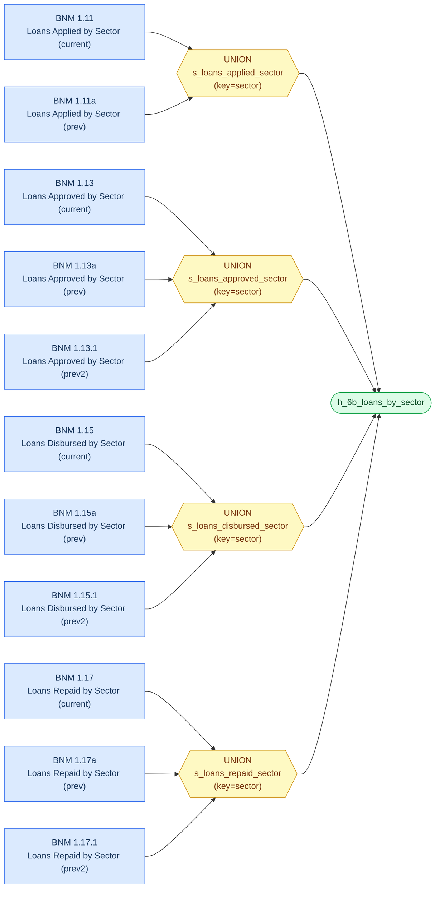
```mermaid
flowchart LR
    classDef raw fill:#dbeafe,stroke:#2563eb,color:#1e3a5f
    classDef stitch fill:#fef9c3,stroke:#ca8a04,color:#78350f
    classDef out fill:#dcfce7,stroke:#16a34a,color:#14532d

    r_1_11["BNM 1.11\nLoans Applied by Sector (current)"]:::raw
    r_1_11a["BNM 1.11a\nLoans Applied by Sector (prev)"]:::raw
    st_las{{"UNION\ns_loans_applied_sector\n(key=sector)"}}:::stitch

    r_1_13["BNM 1.13\nLoans Approved by Sector (current)"]:::raw
    r_1_13a["BNM 1.13a\nLoans Approved by Sector (prev)"]:::raw
    r_1_13_1["BNM 1.13.1\nLoans Approved by Sector (prev2)"]:::raw
    st_lvs{{"UNION\ns_loans_approved_sector\n(key=sector)"}}:::stitch

    r_1_15["BNM 1.15\nLoans Disbursed by Sector (current)"]:::raw
    r_1_15a["BNM 1.15a\nLoans Disbursed by Sector (prev)"]:::raw
    r_1_15_1["BNM 1.15.1\nLoans Disbursed by Sector (prev2)"]:::raw
    st_lds{{"UNION\ns_loans_disbursed_sector\n(key=sector)"}}:::stitch

    r_1_17["BNM 1.17\nLoans Repaid by Sector (current)"]:::raw
    r_1_17a["BNM 1.17a\nLoans Repaid by Sector (prev)"]:::raw
    r_1_17_1["BNM 1.17.1\nLoans Repaid by Sector (prev2)"]:::raw
    st_lrs{{"UNION\ns_loans_repaid_sector\n(key=sector)"}}:::stitch

    h6b(["h_6b_loans_by_sector"]):::out

    r_1_11 --> st_las
    r_1_11a --> st_las
    r_1_13 --> st_lvs
    r_1_13a --> st_lvs
    r_1_13_1 --> st_lvs
    r_1_15 --> st_lds
    r_1_15a --> st_lds
    r_1_15_1 --> st_lds
    r_1_17 --> st_lrs
    r_1_17a --> st_lrs
    r_1_17_1 --> st_lrs

    st_las --> h6b
    st_lvs --> h6b
    st_lds --> h6b
    st_lrs --> h6b
```

---

## 5. Banking System — SME Loans

Covers: `h_6c_sme_loans`

All five SME tables are direct (no stitching needed — single edition each).

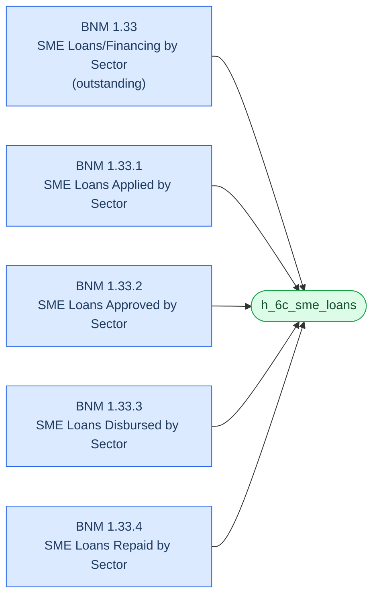
```mermaid
flowchart LR
    classDef raw fill:#dbeafe,stroke:#2563eb,color:#1e3a5f
    classDef out fill:#dcfce7,stroke:#16a34a,color:#14532d

    r_1_33["BNM 1.33\nSME Loans/Financing by Sector\n(outstanding)"]:::raw
    r_1_33_1["BNM 1.33.1\nSME Loans Applied by Sector"]:::raw
    r_1_33_2["BNM 1.33.2\nSME Loans Approved by Sector"]:::raw
    r_1_33_3["BNM 1.33.3\nSME Loans Disbursed by Sector"]:::raw
    r_1_33_4["BNM 1.33.4\nSME Loans Repaid by Sector"]:::raw
    h6c(["h_6c_sme_loans"]):::out

    r_1_33 --> h6c
    r_1_33_1 --> h6c
    r_1_33_2 --> h6c
    r_1_33_3 --> h6c
    r_1_33_4 --> h6c
```

---

## 6. Banking System — Deposits & Funding

Covers: `h_7_deposits_funding`

Islamic deposits stitch current + historical; conventional deposits are direct.

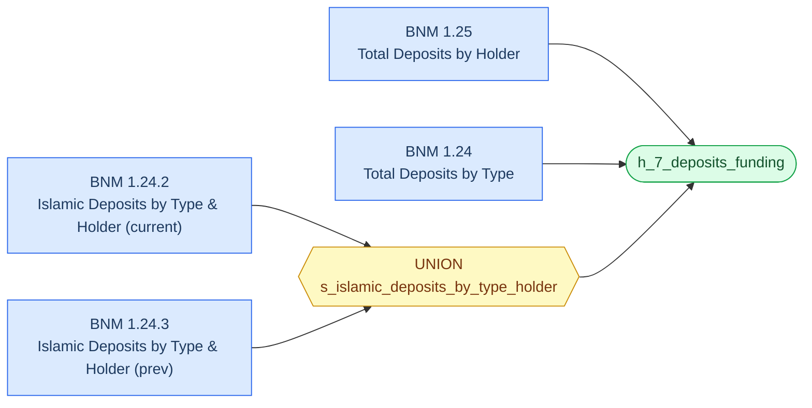
```mermaid
flowchart LR
    classDef raw fill:#dbeafe,stroke:#2563eb,color:#1e3a5f
    classDef stitch fill:#fef9c3,stroke:#ca8a04,color:#78350f
    classDef out fill:#dcfce7,stroke:#16a34a,color:#14532d

    r_1_25["BNM 1.25\nTotal Deposits by Holder"]:::raw
    r_1_24["BNM 1.24\nTotal Deposits by Type"]:::raw

    r_1_24_2["BNM 1.24.2\nIslamic Deposits by Type & Holder (current)"]:::raw
    r_1_24_3["BNM 1.24.3\nIslamic Deposits by Type & Holder (prev)"]:::raw
    st_isd{{"UNION\ns_islamic_deposits_by_type_holder"}}:::stitch

    h7(["h_7_deposits_funding"]):::out

    r_1_24_2 --> st_isd
    r_1_24_3 --> st_isd

    r_1_25 --> h7
    r_1_24 --> h7
    st_isd --> h7
```

---

## 7. Banking System — Payments

Covers: `h_8_payments`

Cheques stitch current + historical; cards are direct.

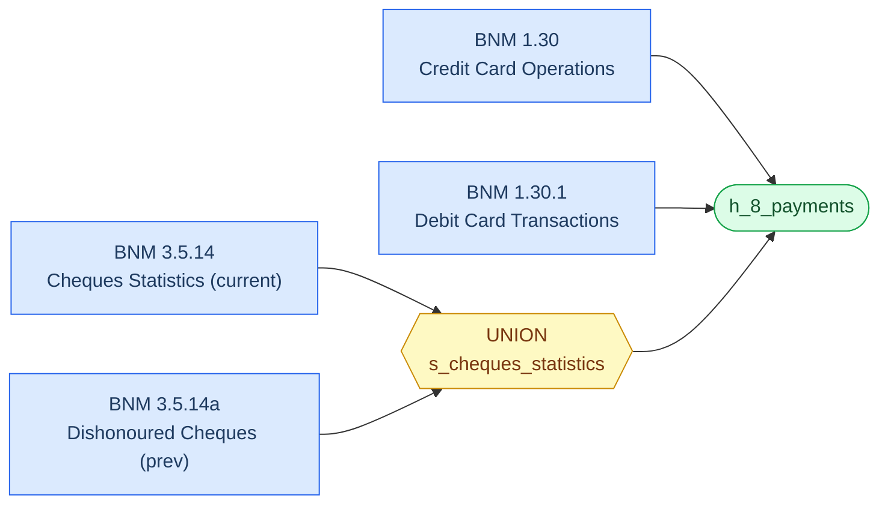
```mermaid
flowchart LR
    classDef raw fill:#dbeafe,stroke:#2563eb,color:#1e3a5f
    classDef stitch fill:#fef9c3,stroke:#ca8a04,color:#78350f
    classDef out fill:#dcfce7,stroke:#16a34a,color:#14532d

    r_1_30["BNM 1.30\nCredit Card Operations"]:::raw
    r_1_30_1["BNM 1.30.1\nDebit Card Transactions"]:::raw

    r_3_5_14["BNM 3.5.14\nCheques Statistics (current)"]:::raw
    r_3_5_14a["BNM 3.5.14a\nDishonoured Cheques (prev)"]:::raw
    st_chq{{"UNION\ns_cheques_statistics"}}:::stitch

    h8(["h_8_payments"]):::out

    r_3_5_14 --> st_chq
    r_3_5_14a --> st_chq

    r_1_30 --> h8
    r_1_30_1 --> h8
    st_chq --> h8
```

---

## 8. Banking System — Asset Quality & Provisions

Covers: `h_9_asset_quality_provisions`

Islamic MFRS 9 stitches **five** editions (the deepest historical chain in the pipeline).

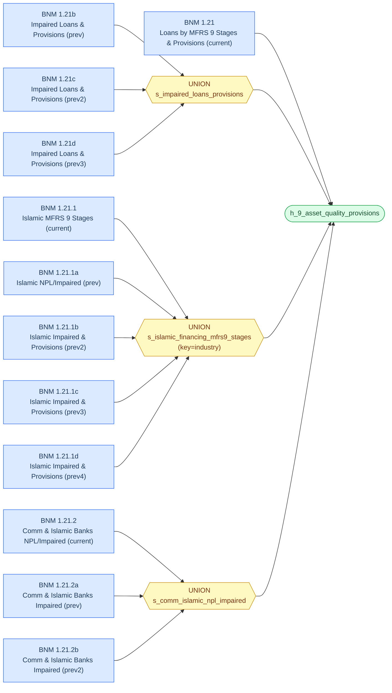
```mermaid
flowchart LR
    classDef raw fill:#dbeafe,stroke:#2563eb,color:#1e3a5f
    classDef stitch fill:#fef9c3,stroke:#ca8a04,color:#78350f
    classDef out fill:#dcfce7,stroke:#16a34a,color:#14532d

    r_1_21["BNM 1.21\nLoans by MFRS 9 Stages & Provisions (current)"]:::raw

    r_1_21b["BNM 1.21b\nImpaired Loans & Provisions (prev)"]:::raw
    r_1_21c["BNM 1.21c\nImpaired Loans & Provisions (prev2)"]:::raw
    r_1_21d["BNM 1.21d\nImpaired Loans & Provisions (prev3)"]:::raw
    st_ilp{{"UNION\ns_impaired_loans_provisions"}}:::stitch

    r_1_21_1["BNM 1.21.1\nIslamic MFRS 9 Stages (current)"]:::raw
    r_1_21_1a["BNM 1.21.1a\nIslamic NPL/Impaired (prev)"]:::raw
    r_1_21_1b["BNM 1.21.1b\nIslamic Impaired & Provisions (prev2)"]:::raw
    r_1_21_1c["BNM 1.21.1c\nIslamic Impaired & Provisions (prev3)"]:::raw
    r_1_21_1d["BNM 1.21.1d\nIslamic Impaired & Provisions (prev4)"]:::raw
    st_imfrs{{"UNION\ns_islamic_financing_mfrs9_stages\n(key=industry)"}}:::stitch

    r_1_21_2["BNM 1.21.2\nComm & Islamic Banks NPL/Impaired (current)"]:::raw
    r_1_21_2a["BNM 1.21.2a\nComm & Islamic Banks Impaired (prev)"]:::raw
    r_1_21_2b["BNM 1.21.2b\nComm & Islamic Banks Impaired (prev2)"]:::raw
    st_cinpl{{"UNION\ns_comm_islamic_npl_impaired"}}:::stitch

    h9(["h_9_asset_quality_provisions"]):::out

    r_1_21b --> st_ilp
    r_1_21c --> st_ilp
    r_1_21d --> st_ilp

    r_1_21_1 --> st_imfrs
    r_1_21_1a --> st_imfrs
    r_1_21_1b --> st_imfrs
    r_1_21_1c --> st_imfrs
    r_1_21_1d --> st_imfrs

    r_1_21_2 --> st_cinpl
    r_1_21_2a --> st_cinpl
    r_1_21_2b --> st_cinpl

    r_1_21 --> h9
    st_ilp --> h9
    st_imfrs --> h9
    st_cinpl --> h9
```

---

## 9. Financial Markets — Interest Rates

Covers: `h_10_interest_rates`

Three stitched series join on date: banking rates, Islamic profit rates, and outstanding loan type breakdown.

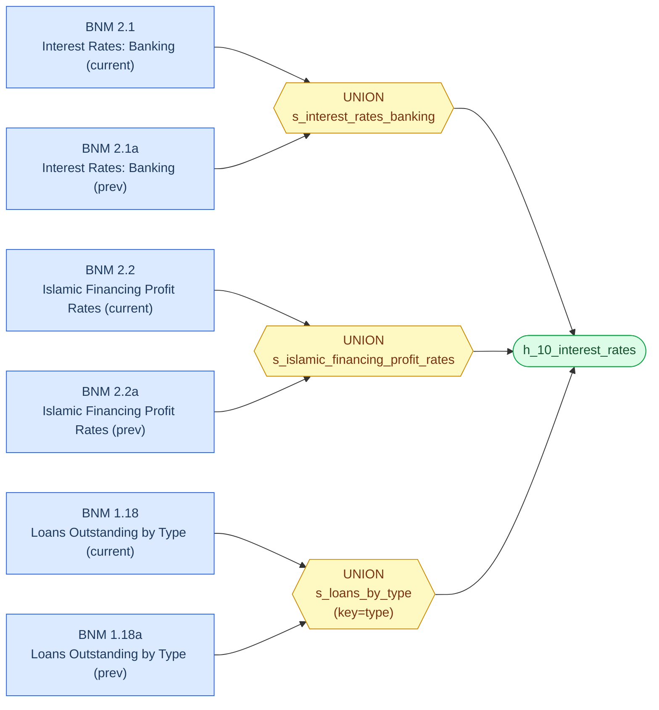
```mermaid
flowchart LR
    classDef raw fill:#dbeafe,stroke:#2563eb,color:#1e3a5f
    classDef stitch fill:#fef9c3,stroke:#ca8a04,color:#78350f
    classDef out fill:#dcfce7,stroke:#16a34a,color:#14532d

    r_2_1["BNM 2.1\nInterest Rates: Banking (current)"]:::raw
    r_2_1a["BNM 2.1a\nInterest Rates: Banking (prev)"]:::raw
    st_irb{{"UNION\ns_interest_rates_banking"}}:::stitch

    r_2_2["BNM 2.2\nIslamic Financing Profit Rates (current)"]:::raw
    r_2_2a["BNM 2.2a\nIslamic Financing Profit Rates (prev)"]:::raw
    st_ipr{{"UNION\ns_islamic_financing_profit_rates"}}:::stitch

    r_1_18["BNM 1.18\nLoans Outstanding by Type (current)"]:::raw
    r_1_18a["BNM 1.18a\nLoans Outstanding by Type (prev)"]:::raw
    st_lbt{{"UNION\ns_loans_by_type\n(key=type)"}}:::stitch

    h10(["h_10_interest_rates"]):::out

    r_2_1 --> st_irb
    r_2_1a --> st_irb
    r_2_2 --> st_ipr
    r_2_2a --> st_ipr
    r_1_18 --> st_lbt
    r_1_18a --> st_lbt

    st_irb --> h10
    st_ipr --> h10
    st_lbt --> h10
```

---

## 10. Financial Markets — Exchange Rates

Covers: `h_11_exchange_rates`

Daily and monthly MYR rates joined directly (no stitching).

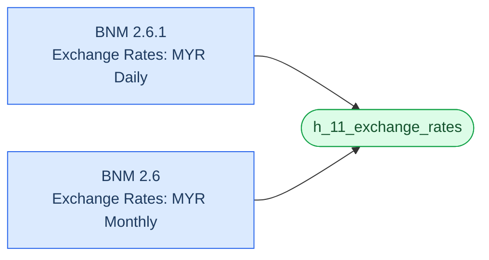
```mermaid
flowchart LR
    classDef raw fill:#dbeafe,stroke:#2563eb,color:#1e3a5f
    classDef out fill:#dcfce7,stroke:#16a34a,color:#14532d

    r_2_6_1["BNM 2.6.1\nExchange Rates: MYR Daily"]:::raw
    r_2_6["BNM 2.6\nExchange Rates: MYR Monthly"]:::raw
    h11(["h_11_exchange_rates"]):::out

    r_2_6_1 --> h11
    r_2_6 --> h11
```

---

## 11. Financial Markets — Money Market Activity

Covers: `h_12_money_market_activity`

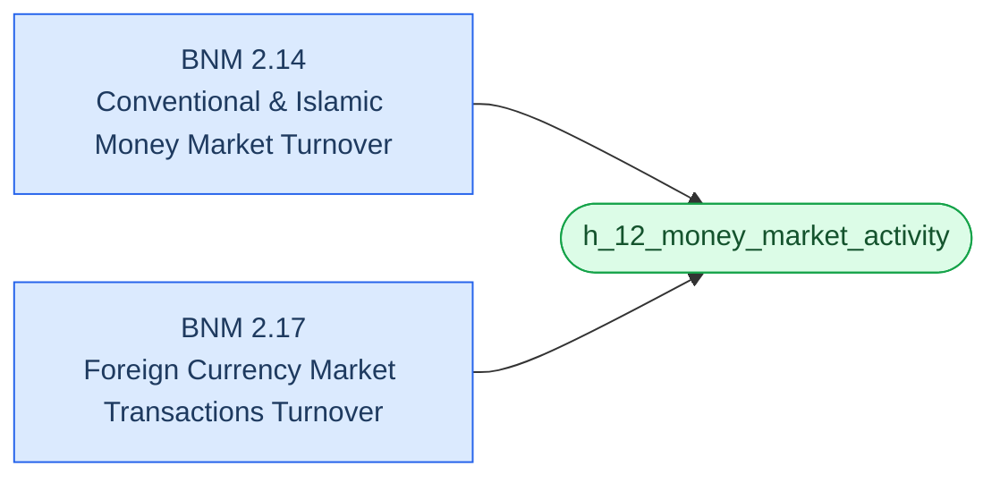
```mermaid
flowchart LR
    classDef raw fill:#dbeafe,stroke:#2563eb,color:#1e3a5f
    classDef out fill:#dcfce7,stroke:#16a34a,color:#14532d

    r_2_14["BNM 2.14\nConventional & Islamic Money Market Turnover"]:::raw
    r_2_17["BNM 2.17\nForeign Currency Market Transactions Turnover"]:::raw
    h12(["h_12_money_market_activity"]):::out

    r_2_14 --> h12
    r_2_17 --> h12
```

---

## 12. Financial Markets — Bond & Sukuk

Covers: `h_13_bond_sukuk`

Combines corporate issuance, secondary market turnover, and foreign holdings (from Section 3).

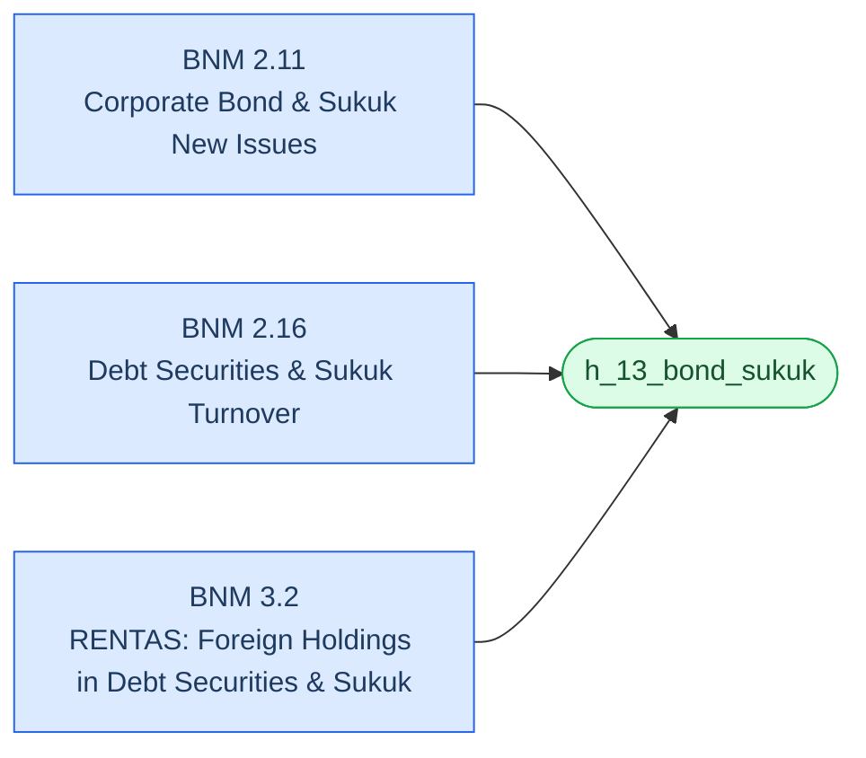
```mermaid
flowchart LR
    classDef raw fill:#dbeafe,stroke:#2563eb,color:#1e3a5f
    classDef out fill:#dcfce7,stroke:#16a34a,color:#14532d

    r_2_11["BNM 2.11\nCorporate Bond & Sukuk New Issues"]:::raw
    r_2_16["BNM 2.16\nDebt Securities & Sukuk Turnover"]:::raw
    r_3_2["BNM 3.2\nRENTAS: Foreign Holdings in Debt Securities & Sukuk"]:::raw
    h13(["h_13_bond_sukuk"]):::out

    r_2_11 --> h13
    r_2_16 --> h13
    r_3_2 --> h13
```

---

## 13. Financial Markets — Derivatives

Covers: `h_14_derivatives`

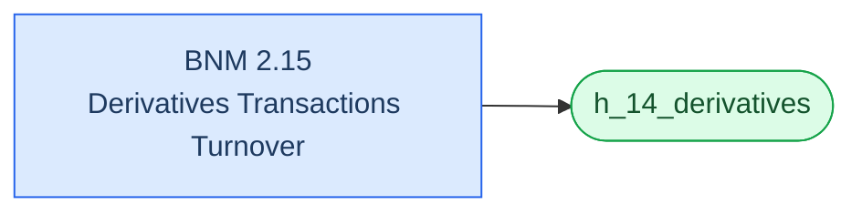
```mermaid
flowchart LR
    classDef raw fill:#dbeafe,stroke:#2563eb,color:#1e3a5f
    classDef out fill:#dcfce7,stroke:#16a34a,color:#14532d

    r_2_15["BNM 2.15\nDerivatives Transactions Turnover"]:::raw
    h14(["h_14_derivatives"]):::out

    r_2_15 --> h14
```

---

## 14. Financial Markets — Capital Raising

Covers: `h_15_capital_raising`

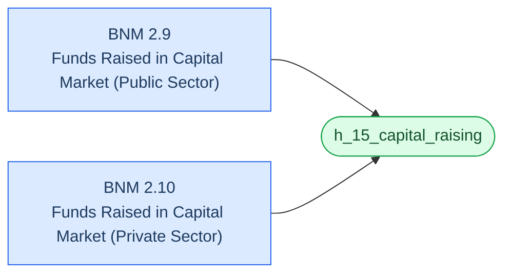
```mermaid
flowchart LR
    classDef raw fill:#dbeafe,stroke:#2563eb,color:#1e3a5f
    classDef out fill:#dcfce7,stroke:#16a34a,color:#14532d

    r_2_9["BNM 2.9\nFunds Raised in Capital Market (Public Sector)"]:::raw
    r_2_10["BNM 2.10\nFunds Raised in Capital Market (Private Sector)"]:::raw
    h15(["h_15_capital_raising"]):::out

    r_2_9 --> h15
    r_2_10 --> h15
```

---

## 15. Insurance & Takaful — Balance Sheet

Covers: `h_16_insurance_balance_sheet`

Four tables — conventional and Islamic, assets and capital adequacy — joined directly.

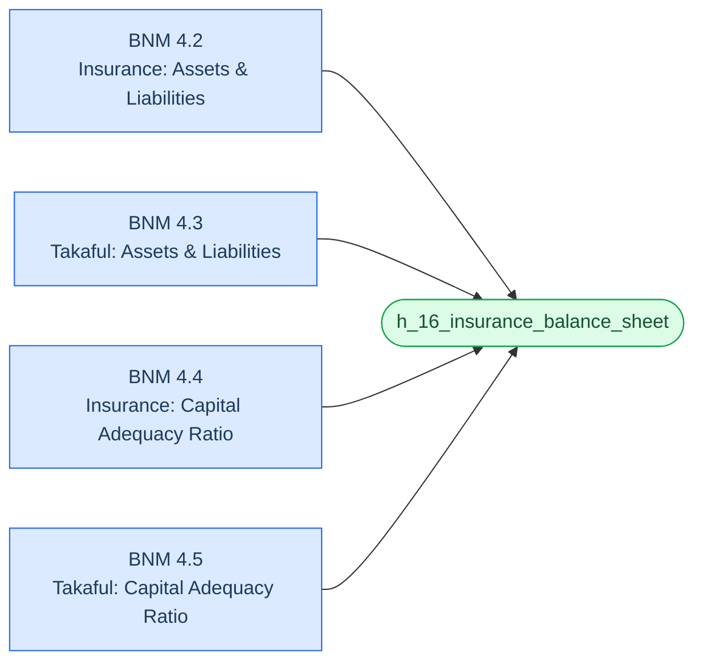
```mermaid
flowchart LR
    classDef raw fill:#dbeafe,stroke:#2563eb,color:#1e3a5f
    classDef out fill:#dcfce7,stroke:#16a34a,color:#14532d

    r_4_2["BNM 4.2\nInsurance: Assets & Liabilities"]:::raw
    r_4_3["BNM 4.3\nTakaful: Assets & Liabilities"]:::raw
    r_4_4["BNM 4.4\nInsurance: Capital Adequacy Ratio"]:::raw
    r_4_5["BNM 4.5\nTakaful: Capital Adequacy Ratio"]:::raw
    h16(["h_16_insurance_balance_sheet"]):::out

    r_4_2 --> h16
    r_4_3 --> h16
    r_4_4 --> h16
    r_4_5 --> h16
```

---

## 16. Insurance & Takaful — Life & Family

Covers: `h_17_life_family_insurance`

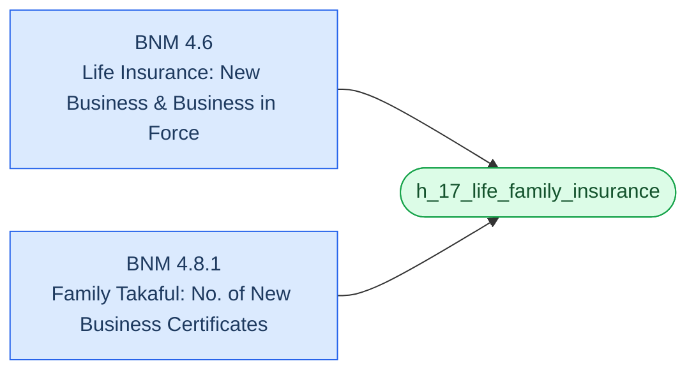
```mermaid
flowchart LR
    classDef raw fill:#dbeafe,stroke:#2563eb,color:#1e3a5f
    classDef out fill:#dcfce7,stroke:#16a34a,color:#14532d

    r_4_6["BNM 4.6\nLife Insurance: New Business & Business in Force"]:::raw
    r_4_8_1["BNM 4.8.1\nFamily Takaful: No. of New Business Certificates"]:::raw
    h17(["h_17_life_family_insurance"]):::out

    r_4_6 --> h17
    r_4_8_1 --> h17
```

---

## 17. Insurance & Takaful — General

Covers: `h_18_general_insurance_takaful`

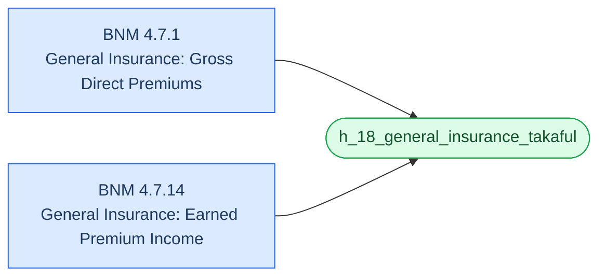
```mermaid
flowchart LR
    classDef raw fill:#dbeafe,stroke:#2563eb,color:#1e3a5f
    classDef out fill:#dcfce7,stroke:#16a34a,color:#14532d

    r_4_7_1["BNM 4.7.1\nGeneral Insurance: Gross Direct Premiums"]:::raw
    r_4_7_14["BNM 4.7.14\nGeneral Insurance: Earned Premium Income"]:::raw
    h18(["h_18_general_insurance_takaful"]):::out

    r_4_7_1 --> h18
    r_4_7_14 --> h18
```

---

## 18. Insurance & Takaful — Intermediaries

Covers: `h_19_intermediaries`

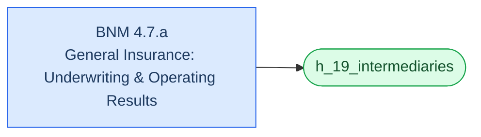
```mermaid
flowchart LR
    classDef raw fill:#dbeafe,stroke:#2563eb,color:#1e3a5f
    classDef out fill:#dcfce7,stroke:#16a34a,color:#14532d

    r_4_7a["BNM 4.7.a\nGeneral Insurance: Underwriting & Operating Results"]:::raw
    h19(["h_19_intermediaries"]):::out

    r_4_7a --> h19
```

---

## 19. Employment

Covers: `h_20_employment`

```mermaid
flowchart LR
    classDef raw fill:#dbeafe,stroke:#2563eb,color:#1e3a5f
    classDef out fill:#dcfce7,stroke:#16a34a,color:#14532d

    r_3_5_12a["BNM 3.5.12a\nLabour Market Indicators: Financial Services Sector"]:::raw
    h20(["h_20_employment"]):::out

    r_3_5_12a --> h20
```

---

## 20. International

Covers: `h_21_international`

Cross-sector table: combines a trade statistic (gross imports) with an external debt position.

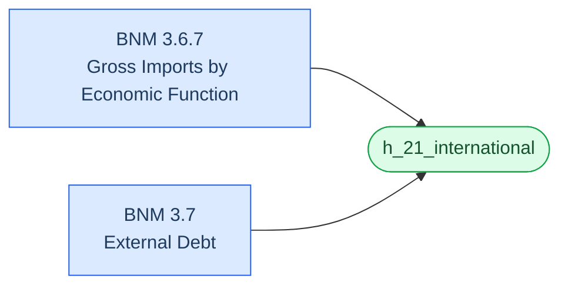
```mermaid
flowchart LR
    classDef raw fill:#dbeafe,stroke:#2563eb,color:#1e3a5f
    classDef out fill:#dcfce7,stroke:#16a34a,color:#14532d

    r_3_6_7["BNM 3.6.7\nGross Imports by Economic Function"]:::raw
    r_3_7["BNM 3.7\nExternal Debt"]:::raw
    h21(["h_21_international"]):::out

    r_3_6_7 --> h21
    r_3_7 --> h21
```

---

## Appendix: Stitch Tables Without a Harmonised Output

The following `s_` tables are built during Stage 2b but are **not yet consumed** by any domain rule. They represent stitched timeseries available for future harmonised datasets.

| Stitch table | Sources (current → historical) | Key column |
|---|---|---|
| `s_comm_islamic_liabilities` | 1.9.2, 1.9.2.1 | — |
| `s_finance_cos_liabilities` | 1.9.5, 1.9.5.1 | — |
| `s_loans_by_purpose` | 1.19, 1.19a, 1.19b, 1.19c | `purpose` |
| `s_loans_by_sector` | 1.20, 1.20a, 1.20b | `sector` |
| `s_islamic_financing_by_type` | 1.18.1, 1.18.1a | `type` |
| `s_islamic_financing_by_shariah` | 1.18.2, 1.18.2a | `industry` |
| `s_islamic_financing_purpose_sector` | 1.19.1, 1.19.1a | `industry` |
| `s_household_loans_by_purpose` | 1.19.6, 1.19.6a | `purpose` |
| `s_comm_islamic_loans_by_sector` | 1.20.1, 1.20.2 | `sector` |
| `s_investment_banks_loans_by_sector` | 1.20.3, 1.20.4 | `sector` |
| `s_investment_banks_npl_impaired` | 1.21.3, 1.21.3a, 1.21.3b | — |
| `s_impaired_loans_by_purpose` | 1.22, 1.22c | `purpose` |
| `s_npl_by_purpose` | 1.22a, 1.22b | `purpose` |
| `s_npl_by_sector` | 1.23a, 1.23b | `sector` |
